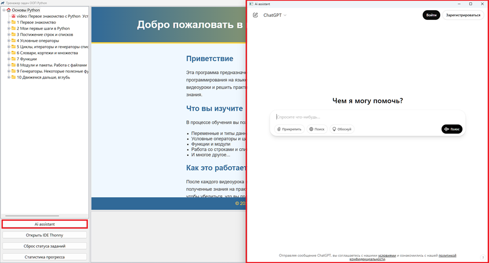

# Добро пожаловать в программу обучения основам Python!

## Приветствие

Эта программа предназначена для начинающих, которые хотят освоить основы программирования на языке Python. Мы предлагаем вам пройти через теоретические видеоуроки и решить практические задания, которые помогут вам закрепить полученные знания.

## Что вы изучите

В процессе обучения вы познакомитесь с основными концепциями Python:

- Переменные и типы данных
- Условные операторы и циклы
- Функции и модули
- Работа со строками и списками
- И многое другое...

## Как это работает

После каждого видеоурока вам будут предложены задания, которые помогут вам применить полученные знания на практике. Эти задания будут проверяться с использованием тестов, чтобы убедиться, что вы правильно усвоили материал.

### Что вас ждёт:

После завершения курса вы сможете уверенно писать программы на Python и решать базовые задачи. Программа поможет вам понять, как эффективно использовать Python для создания простых и понятных решений.

## Умные помощники

В программе есть полезные функции, которые помогут вам справиться с задачами и лучше понять работу кода.

**"AI Assistant"**, вы сможете открыть ChatGPT, который поможет вам решить сложную задачу или получить справку по интересующему вас вопросу.

**IDE Thonny** — это отличная среда разработки для начинающих. Она позволяет пошагово выполнять ваш код, наглядно показывая, как он работает, что упрощает процесс обучения.  
[Официальный сайт *Thonny Python IDE for beginners*](https://thonny.org/)  

## Об Авторе

**Сергей Балакирев (selfedu)** – преподаватель и автор обучающих курсов по программированию. Сергей Балакирев — программист, преподаватель и кандидат технических наук, известный под никнеймом selfedu. Он занимается созданием образовательного контента по программированию, специализируясь на языках Python и C/C++.

Его материалы ориентированы на разработчиков разного уровня — от начинающих до продвинутых пользователей. Сергей активно ведёт свой YouTube-канал, где делится уроками по Python, C/C++, машинному обучению и другим темам. Его объяснения отличаются доступностью и глубиной, что делает обучение комфортным даже для тех, кто только начинает программировать.

Помимо видеоуроков, Сергей развивает сайт ProProProgs, где публикует статьи, разборы сложных тем и дополнительные материалы по программированию. На этом сайте можно найти подробные объяснения концепций ООП, магических методов в Python, работы с базами данных и других важных тем.

Кроме того, он является автором онлайн-курсов на платформе Stepik. Один из самых популярных курсов — «Добрый, добрый Python ООП», который подробно разбирает принципы объектно-ориентированного программирования в Python. Также он разработал «Практический курс по C/C++», который помогает освоить эти языки с нуля.

**Ссылки на работы Сергея Балакирева (selfedu):**  
*[YouTube-канал selfedu](https://www.youtube.com/@selfedu_rus)*  
*[Официальный сайт ProProProgs](https://proproprogs.ru/)*  
*[Курс «Добрый, добрый Python ООП» (Stepik)](https://stepik.org/course/116336/)*  
*[Курс «Практический курс по C/C++» (Stepik)](https://stepik.org/course/193691)*  

Сергей Балакирев продолжает активно развивать своё сообщество, помогая тысячам людей осваивать программирование и совершенствовать свои навыки.

© 2025 Обучение основам Python для начинающих.  

---
## Запуск приложения для новичков и не только
**1. [Как запустить эту программу ?](README_1_run_as_python_script.md)**  
**2. [Как создать .EXE и запустить эту программу ?](README_2_run_as_windows_application.md)**  
**3. [Скачать готовое приложение для Windows 11 (инсталлятор)](README_3_run_as_installer_windows_application.md)**  